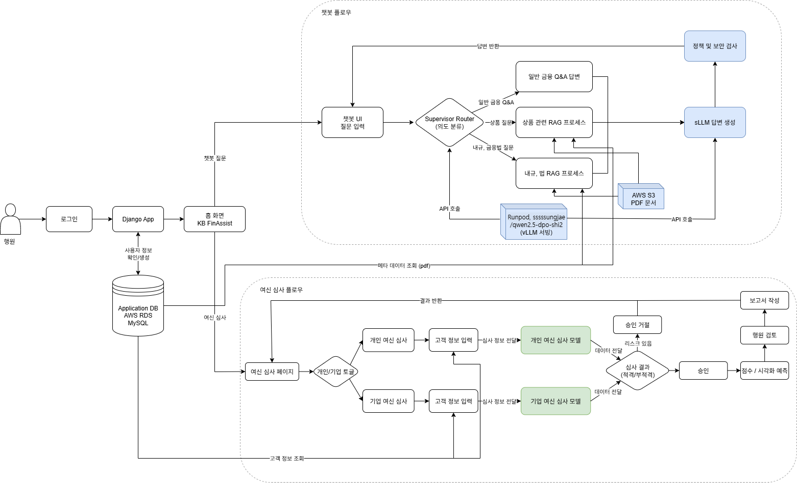

# SKN14-Final-3Team

# 🏦 자체 sLLM을 활용한 은행 사내 업무 AI 플랫폼        
> *부제: “복잡한 금융, 법, 존사배의 앱으로 한 방에”*

---

## 👨‍💻 팀원 소개 및 역할
#### 팀명: 존.사.배 (존중.사랑.배려)
| **이수미** | **김의령** | **조성재** | **이승혁** |
|:--:|:--:|:--:|:--:|
|   |   |   |   |
| PM | RAG, LangGraph, Frontend | sLLM Model, vllm | Model, AWS |


## ⏰프로젝트 기간
2025-08-11 ~ 2025-10-02


## 🎯 프로젝트 주제
**KB 국민은행 창구 업무 도우미 (sLLM)AI 플랫폼**


## 🔥프로젝트 소개
### 서비스명: KB FinAIssist
sLLM과 RAG(Retrieval-Augmented Generation)를 이용한 신입사원용 **업무 적응 도우미 시스템**입니다.
<br>은행 내규 자료와 금융 상품 사용설명서, 금융관련 법규, 여신 심사 데이터 등을 학습 및 데이터베이스화시켜서 특히 은행의 중요한 업무인 **여신업무**에 특화된 챗봇입니다.
<br> 은행에는 수없이 많은 상품과 복잡한 여신업무가 존재하고 금융관련 기업 특성상 보안에 매우 민감합니다.
<br>본 프로젝트는 보안을 sLLM으로 잡고, 수없이 많은 내규 자료를 RAG방식으로 찾아내어서 사원에게 정확하고 빠르게 전달합니다. 그리하여 사원들로 하여금 빠른 업무 진행을 가능하게 하고, 신입사원의 적응을 도와줄 수 있습니다.

---

## 💡 주제 선정 이유 및 배경
### "금융권 IT직무, 하지만 정작 2년간 창구업무를?"

#### 현황 및 배경
은행의 여신 심사 업무는 기업의 재무 상태, 사업성, 관련 법규, 거시 경제 지표 등 방대하고 복합적인 정보를 종합적으로 분석해야 하는 고도의 전문성이 요구됩니다.
그러나 필요한 정보가 사내 DB, DART, 법제처 등 여러 출처에 분산되어 있어, 자료 수집과 분석에 전체 업무 시간의 상당 부분이 소요됩니다.
은행은 전통적으로 신입사원을 직무와 관계없이 최대 2년간 창구에 배치하여, 은행 업무 전반에 대한 기초 이해를 돕고자 합니다.
<br>이는 은행의 운영 구조와 금융업의 기초 지식을 충분히 습득하게 하여 이후 현업에 투입되었을 때 원활한 적응과 업무 수행을 돕기 위함입니다.
최근 은행권은 디지털 전환에 따른 점포 축소와 함께 신입 채용 규모를 대폭 줄이고 있으며, 
또한 비(非)금융 전공자의 경우, OJT(온더잡 트레이닝)를 받더라도 금융 지식 습득 속도가 더딜 수 있어, 이로 인해 본래 직무 투입이 지연되는 사례가 발생하고 있습니다.


#### 구체적 문제점
1) 정보 접근 및 분석의 비효율 : 여전히 데이터가 분산되어 있어, 정보 수집 및 분석에 과도한 시간이 소요됩니다.
2) 데이터 기반 의사결정 미흡 : 정성적 판단에 의존하는 경향이 여전하며, 체계적인 정량 기반 리스크 분석 시스템이 부재합니다.
3) 설명 책임의 어려움 : 대출 승인·거절의 객관적 근거 제시가 어려워, 고객이나 내부 감사팀에 대한 투명성이 저하됩니다.
4) 신입사원 실무 투입 지연 및 채용 감소로 인한 인력 공백 : 장기 창구 근무 구조로 인해 전문 직무 투입 지연이 발생하며, 채용 감소에 따른 인력 보강이 더욱 어려워지고 있습니다.
5) 디지털 전환과 구조 불일치 : 점포 축소와 채용 축소가 병행되는 상황에서, 창구 중심의 인력 구조는 디지털 전략과 상충하며 조직의 민첩성을 저해합니다.


#### 문제 해결 방향 및 기대효과
저희 팀은 이러한 현실적 문제를 해결하고자, 자체 sLLM 기반 사내 업무 지원 플랫폼 도입을 제안드립니다.
1) OJT 효과 극대화 : 금융 지식 및 업무 프로세스를 신속하게 습득할 수 있도록 자동화 보조 제공
2) 조기 직무 투입 가능성 확대 : 2년동안의 창구 근무 없이도 일정 수준의 직무 적응이 가능하도록 지원
3) 업무 효율성 강화 및 생산성 향상 : 심사·분석 업무의 자동화, 데이터 기반 의사결정 체계 마련
4) 조직 유연성 확보 및 디지털 전환 대응 강화 : 축소되는 인력 구조 내에서도 디지털 업무 환경에 민첩하게 대응

## 👟프로젝트 목표

1. **직관적인 대화형 인터페이스**
   - 복잡한 매뉴얼 검색 대신, 챗봇 기반 질의응답시스템
   - 신입 행원의 업무 적응 기간 단축

2. **완벽한 데이터 주권을 위한 'On-Premise' AI**
    - 보안 최우선으로 모든 시스템을 오프라인 생태계로 운영
3. **RAG 시스템으로 정확한 답변 제공**
    - 출처 pdf 실시간 참조 기능으로 환각을 최소화하여 금융권 회사에 맞춤형 시스템 제공

4. **머신 러닝 기반 여신 심사 시스템**
    - 까다롭고 복잡한 여신 심사를 그간의 데이터로 90% 이상의 정확도로 쉽고 빠른 시스템 제공

## ⚙️주요기능

1. **금융 심사 Q&A 챗봇(sLLM)**
    
    - 사내 상품, 관련 법률·제도, 재무제표, 경제 지표에 대해 전문가 수준의 자문 제공
    - 사내 데이터와 공공데이터를 통합한 RAG 기반 검색 + 응답
        - 기능: 자연어 질의 -> 사내 문서+외부문서 검색·리랭크 -> 정확한 답변 + 출처(문서ID) 인용 / 요약.
        - RAG에 기능에서 PDF 파일은 사용자의 질문에 따라 유사도가 높은 기업 문서들을 보여주기
        - 캡쳐나 복붙은 불가하게

2. **머신러닝 기반 대출 적정성 평가 및 대시보드**
    - 고객 재무 데이터 분석
    - 대출 여부·규모를 예측하고 시각화
    
3. **심사 결과 보고서 작성**
   - 대출·여신 심사 결과를 자동으로 분석하고 승인 또는 거절 사유를 설명 가능한 형태로 보고서를 생성
   - 사용자 질문이나 심사 요청이 들어오면 관련 문서를 검색하고 sLLM이 이를 컨텍스트로 활용하여 보고서를 생성
   - 내부 규정 준수 및 설명 가능성을 검증, 내부 감사 대응을 용이하게 만드는 것이 목표.

## 🛠️ 기술 스택

| 구분 | 기술 |
| :--- | :--- |
| **Backend** | Python, Fastapi |
| **Frontend** | Django, HTML, CSS, JavaScript, Bootstrap 5 |
| **AI tool** | LangChain, LangGraph, OpenAI API |
| **Web Design** | Figma |
| **sLLM** | Qwen/Qwen2-7B-Instruct |
| **Vector DB** | Chroma, Pinecone, RDS |
| **File Storage** | AWS S3 |
| **Deploy** | AWS Elastic Beanstalk, Docker |
| **Etc** | LlamaParser, Runpod, vllm |

## 📂 프로젝트 구조
본 프로젝트의 주요 디렉토리 구조와 역할은 다음과 같습니다.
- **`AI/`**: sLLM의 파인튜닝, 평가, FastAPI를 이용한 모델 서빙 API 관련 모든 코드를 포함합니다.
- **`Web/`**: 사용자가 직접 사용하는 Django 기반 웹 애플리케이션의 프론트엔드와 백엔드 코드를 포함합니다.
- **`docs/`**: 프로젝트 기획, 설계, 최종 보고서 등 주요 산출물 문서를 관리합니다.
- **`images/`**: README와 프로젝트 문서에 사용되는 다이어그램 및 스크린샷 이미지를 포함합니다.

## 🚀 시작하기
이 섹션은 프로젝트를 로컬 환경에 설치하고 실행하는 방법을 안내합니다.

### 사전 요구사항
*   Python 3.9+
*   Docker (선택 사항)
*   기타 필요한 라이브러리는 각 폴더의 `requirements.txt` 파일을 참고하세요.

### 설치 및 실행
1.  **리포지토리 복제**
    ```bash
    git clone https://github.com/SKN14-Final-3Team/SKN14-Final-3Team.git
    cd SKN14-Final-3Team
    ```

2.  **웹 애플리케이션 (Django)**
    ```bash
    cd Web
    pip install -r requirements.txt
    python manage.py migrate
    python manage.py runserver
    ```
    웹 브라우저에서 `http://127.0.0.1:8000`으로 접속하여 확인합니다.

3.  **AI 서버 (FastAPI)**
    ```bash
    cd AI
    pip install -r requirements.txt
    uvicorn run_server:app --host 0.0.0.0 --port 8001 --reload
    ```
    AI 서버는 `8001` 포트에서 실행되며, 웹 애플리케이션의 요청을 처리합니다.

### 환경 변수
본 프로젝트는 API 키 및 데이터베이스 설정과 같은 민감한 정보를 환경 변수를 통해 관리합니다. 각 애플리케이션(`Web`, `AI`)의 루트 디렉토리에 `.env` 파일을 생성하고 아래 내용을 참고하여 구성해야 합니다.

`.env.example`
```
# .env.example
DB_HOST=your_db_host
DB_NAME=your_db_name
...
OPENAI_API_KEY=your_api_key
```
*자세한 환경 변수 목록은 `Web/config.py` 및 `AI/src/config.py`를 참고하세요.*

---

## 📊 데이터 (Data)

### 수집데이터 개요
KB 국민은행의 여신 사업을 진행하게 될 은행 사내 직원이 여신 심사 업무 지원 플랫폼을 통해 금융 관련 질문과 답변(QnA)을 수행하고, 고객 심사 및 문서 기반 분석·보고서를 생성할 수 있는 플랫폼을 구성하기 위해 데이터를 수집했습니다.

챗봇(자체 sLLM)이 정확한 답변 및 출처를 제공하기 위해 최신 법령/제도의 문서(PDF)위주 데이터 수집과 KB 국민은행의 내규 데이터와 여신업무 관련 문서 위주로 수집하였으며, 머신러닝 기반 대출 적정성 평가와 심사 결과 보고서 작성을 하기 위해 학습에 필요한 ‘대출 승인 분류 데이터 세트’를 Kaggle에서 수집했습니다.

sLLM 용 데이터로는

`Qwen/Qwen2.5-14B-Instruct` 모델의 파인튜닝에 최적화되어 있으며, 다음과 같은 세 가지 핵심 요소의 균형을 맞춰 구성했습니다.

*   **KB금융 특화 지식**: KB금융그룹 내부 문서를 기반으로 생성된 Q&A
*   **고품질 금융 상식**: 신뢰도 높은 한국 금융 지시(Instruction) 데이터
*   **자연스러운 일상 대화**: 일반적인 질문에 대한 대응 및 모델 페르소나 형성을 위한 데이터

### 데이터 및 출처

*   KB 국민은행, 여신금융협회, 금융감독원, Kaggle

데이터 전처리 과정에서는 PDF 문서를 단순히 불러오는 것만으로는 충분하지 않다는 점을 유의해야 합니다. 예를 들어, PDF 문서의 특성상 표, 이미지, 각주, 머리말·꼬리말, 불필요한 공백이나 줄바꿈 등이 그대로 텍스트로 추출되면 문장이 끊기거나 의미가 왜곡될 수 있습니다. 또한 약관, 규정, 상품설명서와 같은 금융 문서들은 법률적 용어와 긴 문장이 많아 작은 오류만 있어도 검색이나 질의응답 시 부정확한 결과가 발생할 수 있습니다. 이러한 문제를 해결하기 위해서는 단순 로더(loader)를 통한 불러오기보다는 파서(parser)를 활용하여 텍스트 구조를 보다 정교하게 추출하고, 이후 불필요한 기호 제거, 문장 단위 분할, 표준화와 같은 전처리를 거쳐야 합니다. 최종적으로는 이러한 전처리 과정을 통해 데이터의 품질을 확보함으로써 RAG 시스템에서의 검색 정확도를 높이고, 파인튜닝 데이터셋 역시 안정적으로 구축할 수 있습니다.

### sLLM 학습용 데이터셋

`Qwen/Qwen2.5` 모델 시리즈의 파인튜닝에 최적화되어 있으며, 벤치마크 성능 개선을 위해 **순수 금융 데이터**로만 구성하여 모델의 전문성을 극대화하는 것을 목표로 합니다.

*   **KB금융 특화 지식**: KB금융그룹 내부 문서를 기반으로 생성된 Q&A
*   **다양한 유형의 금융 지식**: 일반적인 금융 질의응답(QA)과 객관식 문제(MCQA)를 모두 포함하여 종합적인 금융 이해력 학습을 유도합니다.

**핵심 특징**: 일상 대화 데이터를 제외하고, `aiqwe/FinShibainu`의 QA 및 MCQA 데이터를 대량으로 추가하여 **금융 도메인에 완전히 집중**하도록 데이터셋을 구성했습니다.


#### 데이터 믹싱 및 분할 전략
*   KB 특화 Q&A와 `aiqwe/FinShibainu` QA·MCQA 데이터를 `datasets.concatenate_datasets`로 결합해 총 31,157문항을 구성했습니다.
*   `shuffle(seed=42)`로 데이터를 재배열한 뒤 `train_test_split(test_size=0.05)`로 학습:검증 비율을 95:5로 고정해 지표 변동성을 줄였습니다.
*   DPO 단계에서는 `aiqwe/FinShibainu` 선호쌍과 `javirandor/hh-rlhf-safety-v3-dpo`를 혼합해 금융 맥락을 유지하면서도 안전성 신호를 강화했습니다.

#### 프롬프트 템플릿 구성
*   Qwen Chat Template를 적용해 `<|im_start|>system`, `<|im_start|>user`, `<|im_start|>assistant` 메시지 구조로 변환하고 역할별 컨텍스트를 명확히 분리했습니다.
*   SFT 데이터는 질의와 답변을 role 배열로 매핑하고, DPO 데이터는 `prompt`·`chosen`·`rejected` 삼중 구조를 유지해 선호 학습이 정상 동작하도록 구성했습니다.
*   모든 텍스트를 4,096 토큰 이내로 정규화해 RunPod H100 GPU 메모리 사용량과 배치 안정성을 확보했습니다.

### 📊 데이터 소스 및 구성

총 **31,157건**의 데이터를 아래와 같은 소스에서 조합하고 샘플링했습니다.

| 데이터 종류     | 원본 데이터셋                                                                      | 사용 건수         | 내용                                           |
| --------------- | ---------------------------------------------------------------------------------- | ----------------- | ---------------------------------------------- |
| **KB 특화 데이터**  | `rucipheryn/KB-sLLM-QA-Dataset-Final-Split`                                        | `1,157건` (전체)  | KB금융 관련 PDF 문서에서 추출한 Q&A            |
| **금융 QA 데이터** | `aiqwe/FinShibainu` (qa 스플릿)                                                            | `15,000건` (샘플링) | 일반적인 금융 관련 질의응답 데이터 |
| **금융 MCQA 데이터** | `aiqwe/FinShibainu` (mcqa 스플릿)                                                            | `15,000건` (샘플링) | 객관식 금융 문제 및 정답 데이터 |

## 📂 데이터 구조

모든 데이터는 최종적으로 `Qwen/Qwen2.5` 모델 시리즈의 공식 챗 템플릿이 적용된 단일 `text` 컬럼으로 구성됩니다.

*   **데이터 필드**: `text` (string)
*   **분할 정보**:
    *   `train`: 29,599건 (95%)
    *   `test`: 1,558건 (5%)

#### QA 데이터 예시

```python
<|im_start|>system
You are Qwen, created by Alibaba Cloud. You are a helpful assistant.<|im_end|>
<|im_start|>user
주식집단의 매도와 동시에 매수하는 선물거래의 의미는 무엇인가요?<|im_end|>
<|im_start|>assistant
주식집단의 매도와 동시에 매수하는 선물거래는 주식 시장에서의 헤지(hedging) 전략 또는 차익 거래(arbitrage) 전략으로 이해할 수 있습니다... (이하 답변) ...<|im_end|>
```
#### MCQA 데이터 예시 (특별 전처리 적용)

객관식 문제는 질문과 보기를 합쳐 `user`의 content로 구성하고, `assistant`의 content는 정답에 해당하는 **알파벳**을 포함하도록 변환했습니다.

```python
<|im_start|>system
You are Qwen, created by Alibaba Cloud. You are a helpful assistant.<|im_end|>
<|im_start|>user
T/T 방식의 증가와 신용장 방식의 감소가 시사하는 점은?

A. 은행 간 자금 이동의 신속성이 거래 보안보다 중시된다

B. 기업 간의 신뢰도가 무역 거래의 중요한 요소로 부각된다

C. 무역 거래에서 서류의 역할이 강화되고 있다

D. 금융 기관의 중개 역할이 강화되고 있다<|im_end|>
<|im_start|>assistant
B<|im_end|>
```
### 모델 구성 개요

*   sLLM은 KB 금융 도메인 문서를 학습한 Qwen/Qwen2.5-7B-Instruct 기반 모델로, 감독학습(SFT)과 DPO를 거쳐 규정 친화적인 답변을 제공합니다.
*   LangGraph RAG 파이프라인이 의도 분류, 문서 검색, 정책 가드레일을 처리하고 최종 응답은 RunPod H100(vLLM)에서 서빙되는 sLLM이 생성합니다.
*   Django ↔ FastAPI 백엔드가 vLLM 엔드포인트와 연결되며 세부 운영 절차는 `docs/12. LLM 활용 프로젝트계획.docx`, `docs/13. 전체 LLM 이력서.docx`에 정리되어 있습니다.

| 구성 단계 | 사용 모델 / 리소스 | 주요 역할 | 배포 및 참고 |
| --- | --- | --- | --- |
| Base Prompt Model | Qwen/Qwen2.5-7B-Instruct | 공개 7B 인스트럭션 모델, 금융 도메인 파인튜닝 출발점 | Hugging Face Hub |
| SFT Checkpoint | `sssssungjae/qwen2_5-7b-instruct-finance-full-final-15_15` | KB 규정/QA/MCQA 데이터로 감독 학습한 중간 체크포인트 | RunPod SFT, `docs/13. 전체 LLM 이력서.docx` |
| DPO Checkpoint (Production sLLM) | `sssssungjae/qwen2.5-dpo-shi2` | 선호도 데이터로 보강한 최종 서비스 모델, 규정 준수 답변 강화 | RunPod vLLM Endpoint |
| Guardrail LLM | ChatOpenAI (`MODEL_NAME`) | LangGraph guardrail/structured output 노드에서 정책 검증과 메타데이터 추출 | Elastic Beanstalk .env 설정 |

### 추론 파이프라인 (RAG + sLLM)

1. 사용자의 질문은 Django → FastAPI → LangGraph Intent Router 순으로 전달되어 업무/규정/FAQ 시나리오를 판별합니다.
2. 선택된 시나리오에 따라 Chroma 벡터스토어(Pinecone 백엔드)에 적재된 KB 내규, 금융 교육 자료, 사용자 업로드 문서를 검색합니다.
3. 검색된 컨텍스트와 시스템 프롬프트를 RunPod vLLM 상의 `sssssungjae/qwen2.5-dpo-shi2`에게 전달하여 도메인 특화 응답을 생성합니다.
4. LangGraph Guardrail 노드가 동일한 sLLM과 정책 룰셋(`src/langgraph/guardrails/*.yaml`)을 활용해 금지 표현 필터링, 출처 태깅, JSON 구조화 응답을 수행합니다.
5. 최종 응답과 근거 문서는 FastAPI → Django 백엔드를 거쳐 Web 챗봇 UI에 반환되고, 필요한 경우 MySQL/S3에 이력으로 저장됩니다.

### 모델 성능 및 최종 선택

*   lm-eval-harness 기반 벤치마크에서 Financial-MMLU-KO 0.7495, ArenaHard 71.8, KoBEST 0.60 등(아래 표)으로 DPO 체크포인트가 가장 안정적인 결과를 보였습니다.
*   동일 조건의 SFT 체크포인트는 보수적인 규정 질문에서 높은 정확도를 보였으나, DPO 모델이 난이도 높은 ArenaHard/HAERAE 시나리오까지 균형 잡힌 답변 품질을 확보했습니다.
*   평가 및 운영 절차는 `docs/13. 전체 LLM 이력서.docx`, `docs/14. 테스트 계획 및 결과 보고서.docx`, `evaluation/performance_evaluator.py`에 문서화되어 있어 재현 가능한 형태로 관리됩니다.

### 최종 데이터셋

[🖥️ 데이터셋 링크](https://huggingface.co/datasets/rucipheryn/combined-dataset-30K-final-v4)

## sLLM 학습·튜닝 파이프라인

### 환경 구성
*   RunPod(NVIDIA H100 80GB, vLLM)에서 Docker 컨테이너로 학습과 추론 인프라를 분리해 가동 중단 없이 업데이트할 수 있도록 설계했습니다.
*   Unsloth와 Hugging Face `trl`을 결합해 메모리 사용량을 줄였습니다.
*   학습 산출물은 Hugging Face Hub(`sssssungjae/qwen2_5-7b-instruct-finance-full-final-15_15`, `sssssungjae/qwen2.5-dpo-shi2`)로 버전 관리합니다.

### 학습 절차
1. **데이터 정제**: PDF 기반 원문을 파서로 정규화하고, chat template에 맞춘 role 시퀀스를 생성합니다.
2. **SFT**: `Qwen/Qwen2.5-7B-Instruct`를 2 epoch 전체 파인튜닝해 금융 QA·MCQA 대응력을 확보했습니다.
3. **DPO**: SFT 체크포인트에 `DPOTrainer`를 적용해 선호쌍 학습으로 응답 일관성과 안전성을 강화했습니다.
4. **검증·배포**: HAERAE, KoBEST, ArenaHard, Financial-MMLU-KO 지표를 측정하고, 통과 모델만 RunPod vLLM에 반영합니다.

### 주요 하이퍼파라미터
| 항목 | SFT 설정 | DPO 설정 |
| --- | --- | --- |
| Epoch | 2 | 2 |
| Global Batch (배치×축적) | 8 × 4 | 8 × 4 |
| Learning Rate | 1e-5 | 1e-6 |
| Optimizer | `adamw_torch_fused` | `adamw_torch_fused` |
| Max Sequence Length | 4,096 | 4,096 |
| Warmup Ratio | 0.1 | 0.1 |
| Weight Decay | 0.01 | 0.01 |
| LR Scheduler | `cosine` | `cosine` |
| LoRA α / Dropout | - | 16 / 16 |
| β (DPO) | - | 0.1 |

#### 학습 실행 명령 예시
```bash
# Supervised Fine-Tuning (SFT)
accelerate launch --num_processes=1 scripts/train_sft.py \
  --model_name Qwen/Qwen2.5-7B-Instruct \
  --dataset_path rucipheryn/combined-dataset-30K-final-v4 \
  --max_seq_length 4096 \
  --learning_rate 1e-5 \
  --num_train_epochs 2 \
  --gradient_accumulation_steps 4 \
  --output_dir outputs/sft-finance

# Direct Preference Optimization (DPO)
accelerate launch --num_processes=1 scripts/train_dpo.py \
  --model_name outputs/sft-finance \
  --dataset_path sssssungjae/dpo_shiba_safety1 \
  --beta 0.1 \
  --learning_rate 1e-6 \
  --num_train_epochs 2 \
  --gradient_accumulation_steps 4 \
  --output_dir outputs/dpo-finance
```
*RunPod 컨테이너 기준으로 docs/13. 전체 LLM 시행착오.docx에 정리된 설정을 그대로 이용합니다.*

### 체크포인트 및 배포 전략
*   SFT 결과는 ``sssssungjae/qwen2_5-7b-instruct-finance-full-final-15_15``, DPO 결과는 ``sssssungjae/qwen2.5-dpo-shi2``로 Hub에 업로드하고, `lm-eval-harness`로 재현 가능성을 확보했습니다.
*   Financial-MMLU-KO 0.7099 → 0.7451 → 0.7495, ArenaHard 72.0 → 69.8 → 71.8 개선 추이를 기록해 성능 상승을 수치화했습니다.
*   최종 체크포인트는 RunPod vLLM 서버에 탑재하고, Django/FastAPI 백엔드에서 HTTP 호출로 지연시간과 스루풋을 모니터링합니다.


### 모델 성능 벤치마크

| 체크포인트 | Financial-MMLU-KO | HAERAE | KoBEST | HRM8k_GSM8k | HRM8k_MATH | ArenaHard |
| --- | --- | --- | --- | --- | --- | --- |
| Qwen/Qwen2.5-7B-Instruct (Base) | 0.7099 | 0.50 | 0.60 | 0.81 | 0.62 | 72.0 |
| `sssssungjae/qwen2_5-7b-instruct-finance-full-final-15_15` (SFT) | 0.7451 | 0.57 | 0.61 | 0.79 | 0.61 | 69.8 |
| `sssssungjae/qwen2.5-dpo-shi2` (DPO) | 0.7495 | 0.57 | 0.60 | 0.79 | 0.62 | 71.8 |

#### 모델 선정 및 최종 성능 요약
KB FinAIssist의 핵심 sLLM은 우수한 한국어 성능과 상업적 활용 가능성을 고려하여 `Qwen/Qwen2.5-7B-Instruct`를 기본 모델로 선정했습니다. 저희 팀의 목표는 이 모델을 KB국민은행의 내규와 금융 데이터에 특화시켜, 여신 업무와 같은 복잡한 금융 질의에 대해 전문가 수준의 답변을 제공하는 사내 AI를 개발하는 것이었습니다.

이를 위해 다음과 같은 2단계 파인튜닝 전략을 적용했습니다.
1.  **SFT (Supervised Fine-Tuning)**: KB금융 특화 데이터와 고품질 금융 상식 데이터 약 3만 건을 학습시켜, 모델이 금융 도메인 지식을 깊이 있게 이해하도록 했습니다. 이 단계(`sssssungjae/qwen2_5-7b-instruct-finance-full-final-15_15`)에서 금융 지식 평가 지표(Financial-MMLU-KO)가 **0.7099점에서 0.7451점으로 크게 향상**되었습니다.
2.  **DPO (Direct Preference Optimization)**: SFT 모델을 기반으로, 보다 정제된 답변(Chosen)과 그렇지 않은 답변(Rejected) 쌍을 학습시켜 모델의 응답 스타일을 교정하고 안전성을 강화했습니다.

최종적으로 서비스에 적용된 `sssssungjae/qwen2.5-dpo-shi2` 모델은 Financial-MMLU-KO 점수를 **0.7495점**까지 끌어올려 금융 전문성을 극대화했으며, SFT 단계에서 일시적으로 하락했던 일반 추론 능력(ArenaHard)도 **71.8점**으로 회복했습니다. 이는 최종 모델이 **높은 금융 지식 이해도**와 **안정적인 일반 상식 응답 능력**을 겸비하여, 사내 업무 지원이라는 목표에 가장 잘 부합하는 최적의 결과물임을 의미합니다.

#### 평가 인사이트
- Financial-MMLU-KO 지표가 0.7099 → 0.7451 → 0.7495로 단계별 상승해 금융 도메인 지식 커버리지가 확장되었습니다.
- SFT 단계에서 ArenaHard 점수가 일시적으로 69.8까지 하락했으나 DPO 적용 후 71.8로 회복해 응답 선호도 균형을 맞췄습니다.
- HAERAE/KoBEST는 0.57/0.60 수준을 유지하여 한국어 금융 이슈와 일반 상식에 대한 응답 안정성을 확인했습니다.


---


## 평가 및 모니터링 전략

### 오프라인 평가 도구
*   ``evaluation/performance_evaluator.py``: 120개 QA 세트를 대상으로 MRR, MAP, NDCG, Precision@K 등을 계산하여 릴리스 전 회귀를 점검합니다.
*   `evaluation/pipeline_tester.py`: LangGraph·Intent·기본 RAG 파이프라인을 비교 테스트하며, 메뉴 기반 시나리오로 카테고리·난이도별 품질을 빠르게 확인합니다.
*   `evaluation/manage_data.py`: 문서 업로드, 통계, 조건부 삭제 기능을 제공하여 데이터 스토어 상태를 실시간으로 점검합니다.

### 운영 점검 사이클
1. **일간**: `pipeline_tester.py`의 빠른 테스트(3~5케이스)로 배포 직후 이상 여부를 확인합니다.
2. **주간**: `performance_evaluator.py` 메뉴 4·5를 활용해 카테고리·난이도별 20~50개 케이스를 재평가합니다.
3. **월간**: 120개 풀 테스트와 Financial-MMLU-KO, HAERAE, KoBEST, ArenaHard 지표를 재측정해 모델 드리프트를 감시합니다.

### 주요 모니터링 지표
*   **검색 품질**: Precision@K, Recall@K, MAP, NDCG@K
*   **응답 품질**: Keyword Overlap, Semantic Similarity, Completeness, Relevance
*   **시스템 지표**: 추론 레이턴시, GPU 메모리 사용률(평균 85%), RunPod/Elastic Beanstalk 로그 에러율

### 알림 및 리포트
*   평가 결과는 Notion과 RunPod Dashboard 캡처로 보관하고, 이상치는 ``docs/14. 테스트 계획 및 결과 보고서.docx``에 상세 회고를 남깁니다.
*   긴급 이슈 발생 시 `evaluation/manage_data.py --action delete-condition`으로 문제 문서를 격리한 뒤 재학습 또는 벡터 재생성을 수행합니다.


### RunPod 기반 추론 운영
*   초기 실험은 RunPod A40 40GB 인스턴스(vLLM 0.6.3)에서 진행해 KV 캐시와 4,096 토큰 컨텍스트 설정을 검증했습니다.
*   최종 서비스는 RunPod Serverless GPU(H100 80GB)로 승격해 ``sssssungjae/qwen2.5-dpo-shi2`` 체크포인트를 vLLM으로 상시 구동합니다.
*   FastAPI Orchestrator가 RunPod HTTPS 엔드포인트로 질의와 시스템 프롬프트를 전달하고, LangGraph Supervisor가 스트리밍 응답을 받아 후속 노드에 전달합니다.
*   RunPod 모니터링 지표(평균 GPU 메모리 사용률 약 85%, 요청 대기열)를 수집해 스케일링과 추론 파라미터를 조정합니다.

#### 운영 파라미터
| 항목 | 설정 |
| --- | --- |
| GPU 메모리 제한 | vLLM `--gpu-memory-utilization 0.85` |
| 최대 토큰 길이 | 4,096 tokens (필요 시 8K 이상 증설 실험 진행) |
| 서비스 엔드포인트 | `https://api.runpod.ai/v2/{pod-id}` + FastAPI `/healthcheck` 복합 모니터링 |
| 로깅 정책 | `--disable-log-requests`로 추론 요청 로그 최소화, CloudWatch 보조 수집 |
| 헬스체크 | RunPod `/v1/models` 응답 + LangGraph 세션 헬스 프로브 |

#### 장애 대응 전략
*   RunPod 응답 지연이 3초를 초과하면 Pinecone 검색 결과로 폴백하고, 실패 건은 ``docs/14. 테스트 계획 및 결과 보고서.docx``에 원인 분석을 기록합니다.
*   GPU 상태 이상이 감지되면 RunPod Dashboard 스냅샷을 저장하고, 동일 설정의 예비 파드로 환경 변수를 전환해 무중단을 유지합니다.
*   모델 갱신 시 vLLM의 Warm Reload로 컨텍스트 캐시를 사전 준비하고, FastAPI는 그레이스풀 셧다운으로 세션 손실을 방지합니다.


## 개발 흐름도 (DevOps Flow)


1. Local
    * 개발자가 로컬 환경에서 코드를 작성한 뒤 GitHub 저장소에 Push한다.


2. GitHub
    * Pull Request(PR) -> Main Branch Merge 과정을 통해 배포 준비가 완료된다.

3. CI (Continuous Integration)
    * GitHub Actions가 자동 실행되어 다음 절차가 수행된다.
        * 코드 빌드 및 유닛 테스트 실행
        * Docker 이미지 생성 및 Docker Hub 업로드

4. CD (Continuous Deployment)
    * Elastic Beanstalk이 Docker Hub에서 최신 이미지를 가져와 자동 배포한다.
    * 배포된 컨테이너는 Amazon EC2에서 실행되며, 정적/비정형 데이터는 Amazon S3와 연동된다.

5. 자동화 동작 요약
    * 개발자가 GitHub에 코드 Push
    * GitHub Actions(CI) 실행 -> 빌드 & 테스트 -> Docker 이미지 생성
    * Docker Hub에 이미지 업로드
    * Elastic Beanstalk이 이미지를 가져와 EC2/S3에 자동 배포
    * Django 서비스가 새로운 버전으로 업데이트


---


## 🚶 사용자 흐름도 (User Flow)


1. 사용자 인증
    * 사용자는 Google OAuth 2.0을 통해 인증 후 HTTPS 요청을 전송한다.


2. 요청 전달
    * AWS Route 53이 사용자의 요청을 받아 Amazon EC2 인스턴스로 전달한다.

3. 애플리케이션 서버 처리
    * EC2 내부에서 Django 서버(Nginx + Gunicorn)가 요청을 수신한다.
    * Django는 내부적으로 FastAPI 모듈을 호출하여 후속 처리를 진행한다.

4. 데이터 및 AI 모듈 연동
    * FastAPI는 Chroma DB를 조회하고, sLLM / Machine Learning 모듈을 활용해 질의응답 및 분석을 수행한다.
    * 필요한 경우 Amazon DB(MySQL)와 Amazon S3를 통해 데이터를 조회하거나 저장한다.

5. 응답 반환
    * 최종 결과를 JSON 형태로 변환하여 사용자에게 반환한다.


---
## 🏠 총 시스템 흐름도


### 구성 요소

#### 클라이언트 (Client)

* 컴포넌트
    * Chrome 브라우저

* 인터페이스
    * Google Cloud OAuth 2.0 (인증 처리)
    * JSON 데이터 전송 (HTTPS 기반 통신)

#### AWS Cloud

* EC2 인스턴스
    * Nginx: 리버스 프록시 및 정적 파일 제공
    * Gunicorn: WSGI 서버로 FastAPI 실행 관리
    * Django + FastAPI: 백엔드 애플리케이션, 사용자 요청 처리 및 비즈니스 로직 실행

* LangGraph 모델
    * Pinecone: 벡터 데이터베이스 기반 검색
    * Prompt Engineering: AI 프롬프트 최적화 및 응답 품질 향상

#### 데이터베이스

* Amazon DB (MySQL)
    * 구조적 데이터 저장 및 조회

#### 외부 서비스
* RunPod
    * sLLM 실행 환경 제공 (대규모 언어모델 추론)


## 🏠 시스템 구조도




## 📖 주요 기능 사용법
KB FinAIssist의 주요 기능 사용 시나리오는 다음과 같습니다.

### 금융 Q&A 챗봇
1.  Google 계정으로 로그인합니다.
2.  메인 화면의 챗봇 입력창에 금융 상품, 내규, 또는 법률에 대해 질문합니다. (예: "주택담보대출 LTV 규제에 대해 알려줘")
3.  AI 챗봇이 질문 의도를 파악하여 RAG 파이프라인을 통해 내부 문서에서 근거를 찾습니다.
4.  sLLM이 생성한 답변과 함께, 참고한 원본 문서의 출처가 함께 제공되어 신뢰성을 보장합니다.

### 머신러닝 기반 여신 심사
1.  상단 메뉴에서 '여신 심사' 탭으로 이동합니다.
2.  고객의 재무 및 비재무 정보를 양식에 맞게 입력합니다.
3.  '심사 시작' 버튼을 클릭하면, 머신러닝 모델이 입력된 데이터를 분석하여 대출 적격 여부와 리스크를 평가합니다.
4.  심사 결과는 요약 리포트 형태로 제공되어 빠른 의사결정을 돕습니다.

## ✨ 구현 결과
| 구현 화면 | 역할 | 
|:---------------------------:|:-----------------------------|
|  | 로그인 페이지 |
|  | 메인 화면 |
|  | 메인 화면 2 |
|  | 챗봇 1 |
|  | 자주묻는 질문 |
|  | 출처, 색 변경 |
|  | 출처 페이지 팝업 |
|  |  여신심사, 입력 |
|  | 여신심사, 고객정보 |
|  | 여신심사, 결과 |


## 💯 성능 개선
### 기능 개선 


### 프롬프트 개선

#### 설계 개요
LangGraph 기반 Supervisor-에이전트 구조에 맞춰 프롬프트를 재정비해 질문 유형별 의사결정 기준을 명문화했다. 관리자 노드는 활용 가능한 도구와 우선순위를 구체적으로 안내하고, 문서 기반 하위 에이전트에는 규정 준수형 답변 절차를 명시해 응답 일관성을 높였다.

| 적용 기법 | 적용 위치 또는 특징 요약 |
| --- | --- |
| Role Prompting | `AI/src/langgraph/prompts.yaml`의 `system_prompts.supervisor.system`에서 중앙 관리자 역할과 사용할 도구(answer, rag_search, product_extraction, context_answer)를 명확히 선언해 각 에이전트의 책임을 고정했습니다. |
| Chain-of-Thought Prompting | 동일 프롬프트 말미에 도구 선택 근거를 단계적으로 서술하도록 지시해 판단 흐름을 노출하고 자기검증을 유도합니다. |
| Few-Shot Prompting | `routing_prompts.main_routing`과 `additional_routing`에 질문 유형별 대표 시나리오를 나열해 실제 창구 질문 예시를 기준으로 분기를 학습하게 구성했습니다. |
| Instruction Prompting | `system_prompts.rag_system.system`과 `routing_prompts.context_answer`에서 문서 활용 절차, 금지사항, 문장 수 제한 등을 명문화해 금융 규정 답변 시 품질을 표준화했습니다. |
| Format-Constrained Prompting | 라우팅 프롬프트에서 출력값을 사전 정의된 옵션 문자열로 제한하고, `routing_prompts.context_analysis`는 YES/NO 2값만 허용해 포맷 오류를 방지합니다. |
| User-Centered Prompting | `{query}`와 `{previous_context}`를 중심에 배치해 이용자 질문과 이전 대화 맥락을 우선 고려하도록 안내하고, 상담 어조 준수를 명시해 대화 몰입감을 높였습니다. |

#### 챗봇 프롬프트
- `system_prompts.supervisor`는 질문 분석 -> 도구 선택 -> reasoning 공개 순서를 강제해 신규 직원 문의에도 안정적으로 대응합니다.
- `system_prompts.rag_system`은 검색 컨텍스트만으로 5문장 이내의 근거 기반 답변을 작성하도록 제한해 규제 문서 인용 시 왜곡을 줄입니다.
- `routing_prompts.context_answer`와 `context_analysis`는 이전 발화 요약을 입력값으로 받아 연속 질의에도 맥락 유지 여부를 판정하고, 필요 시 추가 검색으로 자연스럽게 전환시킵니다.

---

### 시행착오와 개선 히스토리
*   **데이터 정제 재설계**: 초기에 PDF 문서에서 각주·머리글이 혼입되어 답변 왜곡이 발생해, `docs/12. LLM 활용 프롬프트 전략.docx`에 정리된 파서 기반 전처리와 문장 재분할 파이프라인을 도입했습니다.
*   **RunPod 메모리 한계 해결**: A40 40GB 환경에서 vLLM 메모리 사용률이 85%에 근접하며 배치 크기가 제한되어, Unsloth 최적화와 LoRA 파라미터 조정 후 H100 80GB Serverless 환경으로 승격했습니다.
*   **선호쌍 품질 관리**: DPO 학습 초기에는 `chosen`·`rejected`가 의미상 유사한 케이스가 다수 발견되어, `docs/13. 전체 LLM 시행착오.docx`의 가이드에 따라 금융 규제·상품 문의 위주로 선별하고 안전성 데이터(hh-rlhf-safety)로 보강했습니다.
*   **평가지표 피드백 루프**: ArenaHard 점수가 SFT 이후 69.8까지 하락한 경험을 바탕으로 DPO 재학습을 진행해 71.8로 회복시켰으며, Financial-MMLU-KO도 0.7099 → 0.7451 → 0.7495로 개선되었습니다.
*   **평가 자동화 정비**: `lm-eval-harness` CLI와 RunPod 로그를 연계해 성능 리포트를 자동 생성하고, 기준 미달 시 재학습 파이프라인을 트리거하도록 설정했습니다.


### **🌱 향후 발전 가능성 (Future Work)**

**1. 'AI 심사역'으로의 진화: XAI 시스템 고도화**
*   현재의 텍스트 기반 XAI를 넘어, 고객의 재무 상태 변화에 따른 **대출 승인 확률 변화를 실시간으로 시뮬레이션**하고, 그 결과를 그래프로 시각화하는 **인터랙티브 대시보드**를 도입합니다.
*   "만약 이 회사의 매출이 10% 증가한다면?" 과 같은 가상 시나리오 분석을 통해, 선제적인 리스크 관리와 컨설팅이 가능한 'AI 심사역'으로 발전시킵니다.

**2. '개인화'된 학습 경험 제공**
*   신입 행원의 질문 이력을 데이터베이스에 저장하고 분석하여, **자주 묻는 질문이나 취약한 업무 분야를 파악**합니다.
*   이를 바탕으로 관련 규정이나 상품 정보를 자동으로 추천해주는 **'맞춤형 학습 푸시 알림'** 기능을 도입하여, 개인별 성장을 지원합니다.

**3. '음성' 기반 업무 영역으로의 확장**
*   고객과의 통화 내용을 실시간으로 텍스트 변환(STT)하고, 대화의 핵심(고객 니즈, 불만사항 등)을 자동으로 요약하여 **'통화 리포트'를 자동 생성**하는 기능을 추가합니다.
*   이를 통해 영업점의 업무 부담을 줄이고, 고객 응대 품질을 데이터 기반으로 분석 및 개선합니다.

**4. 서비스 확장 및 생태계 구축**
*   여신 업무를 넘어, **수신(예/적금), 외환, PB(자산관리)** 등 다른 은행 업무 분야로 AI 어시스턴트의 지식 범위를 확장합니다.
*   신입 행원들이 AI와의 대화 기록이나 보고서 초안을 공유하며 토론하는 **'업무 지식 커뮤니티'** 기능을 도입하여, 집단 지성을 통한 성장을 촉진합니다.

---

## 🌟 향후 발전 방향

**1. 모델 성능 고도화: 챗봇 품질의 지속적 향상**
*   현재 7B 모델을 14B, 27B 등 더 큰 파라미터의 모델로 확장하고, 지속적으로 최신 금융 데이터를 추가 학습시켜 질의응답의 정확성과 깊이를 향상시킵니다.

**2. 실무 적용성 강화: On-Premise 배포 및 시스템 통합**
*   실제 기업의 요구에 맞춰, 내부 기밀 데이터베이스와 안전하게 연동하는 On-Premise 배포를 지원합니다. 이를 통해 단순 업무 보조를 넘어, 실제 여신 심사 프로세스에 직접 통합되는 핵심 시스템으로 발전시킬 수 있습니다.

**3. 솔루션 확장성 확보: 타 금융기관으로의 적용**
*   현재 KB국민은행에 특화된 데이터와 디자인을 모듈화하여, 타 은행, 증권사, 보험사 등 다양한 금융 기관의 특성에 맞게 신속하게 커스터마이징할 수 있는 범용 솔루션으로 발전시킵니다.


---

## 📝 회고록
*   **이수미:** 강사님, 매니저님들께서 실제 현업처럼 스케줄 구성해주시고, 목표 던져주시고 강의해주셔서 다양한 역량을 얻어갈 수 있었던 2달이었습니다. 또한 팀원들과 긴 기간동안 협력해나가는 과정에서도 정말 많은 것들 배우고 얻어갑니다. 함께해주셔서 감사했습니다. 특히 많이 부족했던 웹에 대한 이해도를 올릴 수 잇었고, 앞으로도 MCP와 Langgraph 역량 꾸준히 향상시키고싶습니다! 너무 수고많으셨습니다!!

*   **김의령:** 두 달간의 비교적 짧지 않은 기간 동안 기획부터 배포까지 프로젝트의 전 과정을 직접 경험하며 많은 것을 배울 수 있었습니다. 진행 과정에서는 수면이 부족하고 힘든 순간도 있었지만, 완성된 결과물을 보며 큰 보람과 성취감을 느꼈습니다. 끝까지 열정을 쏟아 함께해 준 팀원들에게 깊은 감사의 말씀을 전합니다.

*   **조성재:** 고비와 고난이 많았지만 훌륭한 팀원들 덕분에 이겨내고 좋게 마무리 지을 수 있어서 행복합니다. 다들 너무 고생하셨고 수고하셨습니다.

*   **이승혁:** 가장 길었던 프로젝트가 끝나고 발표평과 Q&A가 모두 끝났습니다. 그간 있었던 미니 프로젝트와는 비교도 되지 않는 스케일이 커진 프로젝트였습니다. 기획부터 배포까지 모든 과정에 발을 담그면서 정말 제대로 배웠다는 생각이 들었습니다. 특히 밤을 새워가며 열심히 했던 팀원들이 있었기에 여기까지 올 수 있었습니다. 다들 수고하셨습니다!
